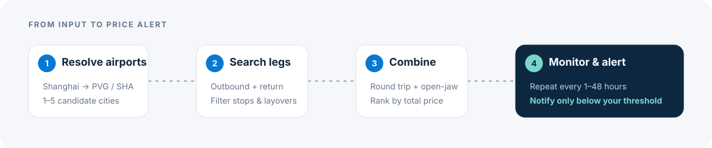

<p align="right">
  <strong>English</strong> · <a href="./README.md">简体中文</a>
</p>

<p align="center">
  
</p>

<p align="center">
  <a href="https://github.com/suneveryday/AdvSearchFlights/releases"></a>
  
  
  <a href="./LICENSE"></a>
</p>

Farello is a local-first flight search and monitoring tool for trips that do not fit into a simple round trip. Give it one origin and up to five candidate destinations; it expands city airports, builds round-trip and open-jaw combinations, filters inconvenient segments, and ranks the results by total price.

- **Explore more combinations** — compare one-destination round trips with multi-city open-jaw routes in one search.
- **Keep the useful details** — see airports, airlines, flight numbers, aircraft, times, stops, layovers, and per-leg prices.
- **Watch prices locally** — schedule repeat searches and receive macOS and Apple Reminders alerts when the total falls below your threshold.

> Farello currently uses Google Flights through [`fli`](https://github.com/punitarani/fli) as its primary source. Search requests leave from your own machine and results are stored in a local SQLite database.

## From candidates to a route worth booking

| Your input | What Farello builds |
| --- | --- |
| `Shanghai → Melbourne` | A conventional round trip: Shanghai → Melbourne → Shanghai |
| `Shanghai → Melbourne, Sydney` | Round trips plus open-jaw combinations such as Shanghai → Melbourne · Sydney → Shanghai |

For every one-way leg, Farello defaults to at most one stop and at most ten hours per layover. It then combines valid legs and sorts the full itineraries by total CNY price.

<p align="center">
  
</p>

## What you can do

- Enter Chinese city names or IATA airport codes; cities expand to known airports such as `Shanghai → PVG/SHA`.
- Search one to five candidate destinations across Economy, Premium Economy, Business, or First.
- Build same-city round trips and non-backtracking open-jaw combinations.
- Filter by stops and layover duration before ranking by total price.
- Review search history, price trends, and saved route groups in the desktop app.
- Filter history by price, airline, departure/arrival airport, stops, layover, and excluded transfer airports.
- Schedule searches every 1–48 hours for up to five history groups.
- Alert only below a chosen threshold, then alert again only when a new lower price appears.
- Use the macOS desktop app, CLI, stable JSON subprocess protocol, or Python package.

## Quick start

### Try the CLI without a network request

Farello requires Python 3.11 or newer.

```bash
git clone https://github.com/suneveryday/AdvSearchFlights.git
cd AdvSearchFlights
python3 -m venv .venv
source .venv/bin/activate
python -m pip install -e ".[dev]"

adv-search-flights search \
  --origin SHA \
  --dest MEL SYD \
  --departure 2026-09-29 \
  --return-date 2026-10-07 \
  --provider mock \
  --format table \
  --limit 2 \
  --no-cooldown
```

Replace `--provider mock` with `--provider auto` when you are ready to query the primary source from your local network.

### Run the macOS app from source

The desktop shell uses React, Tauri 2, and an embedded Python sidecar. In addition to Python, install Node.js and the Rust toolchain.

```bash
# From the repository root, with the Python environment activated
cd desktop
npm install
npm run build:sidecar
npm run tauri dev
```

The first network check tries the current connection, then can discover a reachable local proxy when direct access fails. Farello never uploads proxy credentials.

## CLI usage

```bash
adv-search-flights search \
  --origin Shanghai \
  --dest Tokyo Shizuoka \
  --departure 2026-09-29 \
  --return-date 2026-10-07 \
  --provider auto \
  --cabin-class ECONOMY \
  --max-stops 1 \
  --max-layover-hours 10 \
  --format table \
  --limit 20
```

Run `adv-search-flights search --help` for the complete option list.

<details>
<summary><strong>Core search options</strong></summary>

| Option | Default | Purpose |
| --- | --- | --- |
| `--origin` | required | Chinese city name or IATA airport code |
| `--dest` | required | One to five candidate cities or airports |
| `--departure` | required | Departure date in `YYYY-MM-DD` format |
| `--return-date` | required | Return date in `YYYY-MM-DD` format |
| `--provider` | `auto` | `auto`, `fli`, `skyscanner`, or `mock` |
| `--format` | `table` | `table`, `text`, or `json` |
| `--max-stops` | `1` | Maximum stops per one-way leg |
| `--max-layover-hours` | `10` | Maximum duration of each layover |
| `--cabin-class` | `ECONOMY` | `ECONOMY`, `PREMIUM_ECONOMY`, `BUSINESS`, or `FIRST` |
| `--limit` | unlimited | Truncate after filtering and sorting |
| `--cooldown-seconds` | `90` | Delay between real data calls |
| `--retry-waits` | `30,60,90` | Comma-separated retry delays |

</details>

<details>
<summary><strong>History and GUI protocol commands</strong></summary>

```bash
adv-search-flights history-list --format json
adv-search-flights history-group-list --format json
adv-search-flights history-group-get <group_id> --format json
adv-search-flights history-group-results <group_id> \
  --filters '{"max_total_price": 10000}' \
  --format json
adv-search-flights history-group-delete <group_id> --format json
```

`gui-search` accepts one JSON request on stdin and returns a stable envelope containing `ok`, `response`, `network_status`, `provider_status`, `error`, and `history_batch_id`. See [the architecture notes](./docs/architecture.md) for the desktop-to-Python flow.

</details>

## How it works

1. Resolve the origin and candidate cities into known airports.
2. Query outbound and return options for the relevant airport pairs.
3. Remove legs that violate price, stop, or layover constraints.
4. Combine matching legs into round-trip and open-jaw itineraries.
5. Sort by total price and render table, text, or JSON output.
6. Save successful real searches locally so desktop history and monitoring can reuse them.

The desktop app calls the Python engine through a local subprocess—there is no local web server. Provider logic, combination rules, network diagnostics, and UI code remain separate so each layer can be tested independently. Read [Architecture](./docs/architecture.md) for the full module map.

## Scheduled searches and alerts

From a history group, use the alarm button to configure an interval and optional price threshold. Farello runs once immediately after confirmation and continues only while the app is open.

Alerts require these macOS permissions:

- `System Settings → Notifications → Farello`
- `System Settings → Privacy & Security → Automation → Reminders`

Permission failures do not stop the scheduled search itself.

## Privacy

Analytics are disabled until you explicitly opt in on first launch, and can be disabled later in **Settings → Privacy & Analytics**. When enabled, Farello sends only coarse operational events such as app version, platform, workspace, success state, result-count and duration ranges, standardized error categories, and reminder-channel success.

Routes, dates, airports, prices, inputs, results, history IDs, booking links, thresholds, raw errors, identity, account data, and hardware identifiers are never sent. Farello uses a random local installation ID and disables autocapture, page views, Session Replay, and user profiles.

## Current boundaries

- The desktop application targets macOS; the Python CLI can be developed and tested independently.
- Scheduled searches run only while Farello is open.
- Live results depend on third-party sources and the user's network; providers may change, throttle, or return no priced results.
- `auto` tries Google Flights through `fli` first. The optional Skyscanner adapter is experimental.
- Farello helps compare itineraries; booking is completed on the linked external provider.

## Development

```bash
python -m pytest

cd desktop
npm test
npm run build
```

Contributions are welcome. Please read [CONTRIBUTING.md](./CONTRIBUTING.md), keep provider-specific parsing isolated, and add focused tests for behavior changes. Security reports should follow [SECURITY.md](./SECURITY.md).

## Acknowledgements

- Google Flights adapter: [`punitarani/fli`](https://github.com/punitarani/fli)
- Experimental Skyscanner fallback: [`irrisolto/skyscanner`](https://github.com/irrisolto/skyscanner)

Farello is available under the [MIT License](./LICENSE). Optional third-party providers may use their own licenses.
